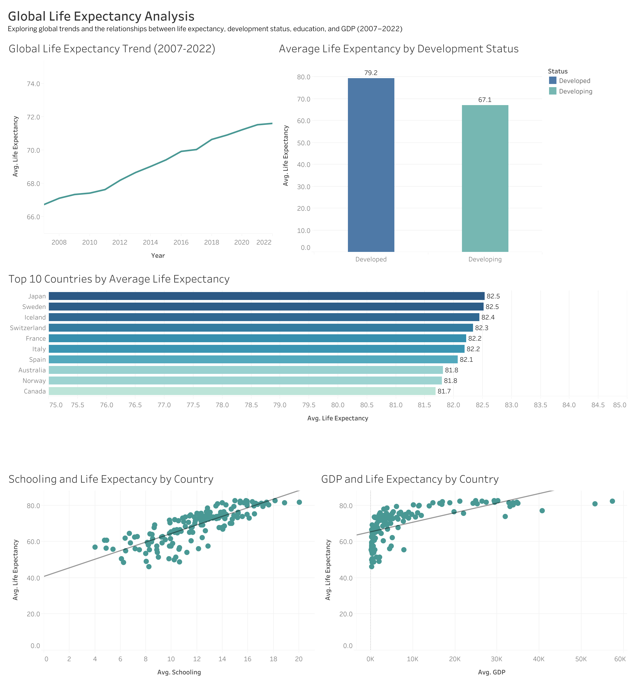
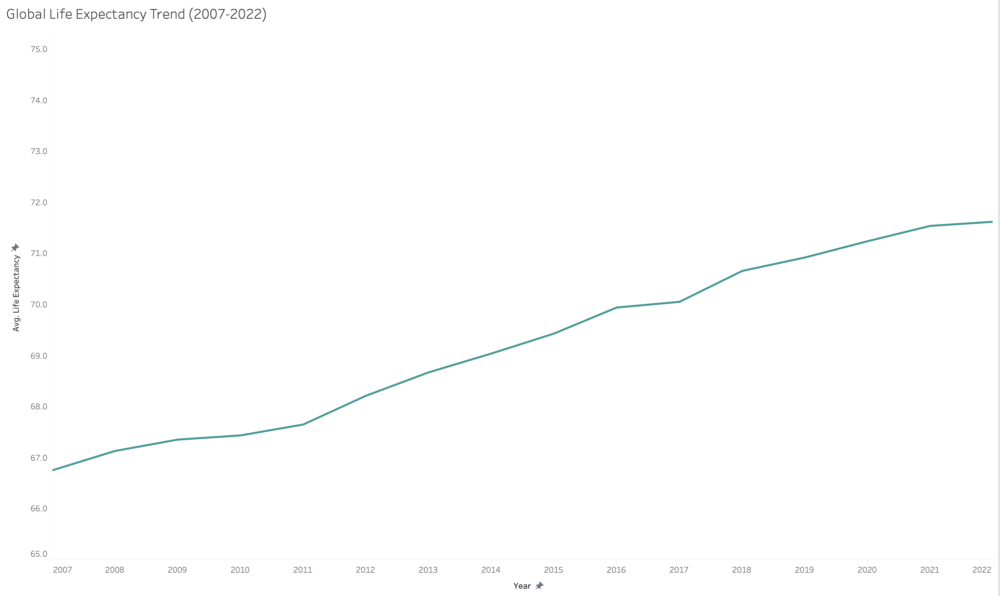
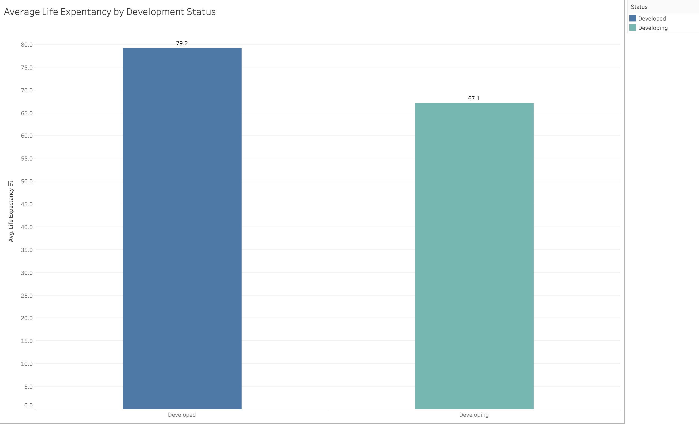
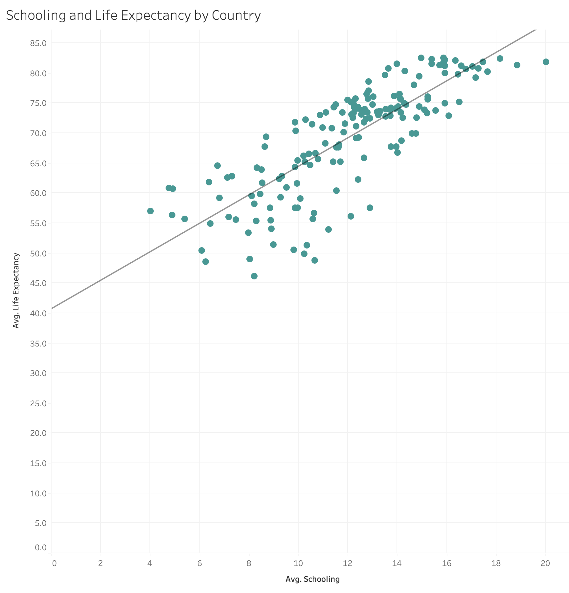

# Global Life Expectancy Analysis

## Executive Summary

Analyzed global life expectancy data from 2007–2022 using **MySQL and Tableau**.

The analysis focused on global trends and the relationships between life expectancy, development status, education, and GDP.

**[View Interactive Tableau Dashboard](https://public.tableau.com/app/profile/cody.o.brien6310/viz/GlobalLifeExpectancyAnalysis_17876037172040/GlobalLifeExpectancyAnalysis)**

---

## Business Problem

This project explores:

- How has global life expectancy changed?
- How large is the developed vs. developing gap?
- Which countries have the highest life expectancy?
- How are schooling and GDP related to life expectancy?

---

## Methodology

**MySQL**
- Cleaned duplicates and missing values
- Standardized the dataset
- Performed exploratory analysis

**Tableau**
- Built 5 visualizations
- Created an interactive dashboard
- Added development-status filtering

---

## Skills

`SQL` `MySQL` `Data Cleaning` `EDA` `Tableau` `Data Visualization` `Dashboard Design`

---

## Results & Insights

### 1. Global Life Expectancy Increased

Average life expectancy increased from **66.8 years in 2007 to 71.6 years in 2022**.

### 2. Development Status Shows a Large Gap

Developed countries averaged **79.2 years**, compared with **67.1 years** for developing countries.

### 3. Schooling and Life Expectancy Are Positively Related

Countries with higher average schooling generally had higher average life expectancy.

---

## Next Steps

- Investigate countries that don't follow the overall trends
- Analyze additional health and socioeconomic factors
- Explore country-level changes over time

---

## Data Note

Development classifications were retained from the original dataset and may not align with modern classifications.
